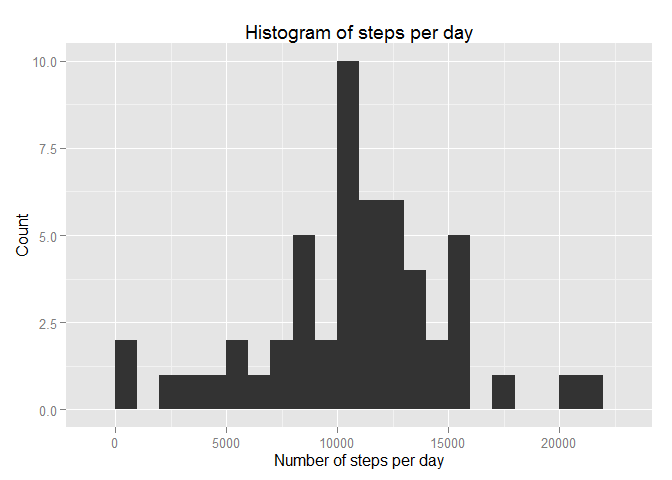
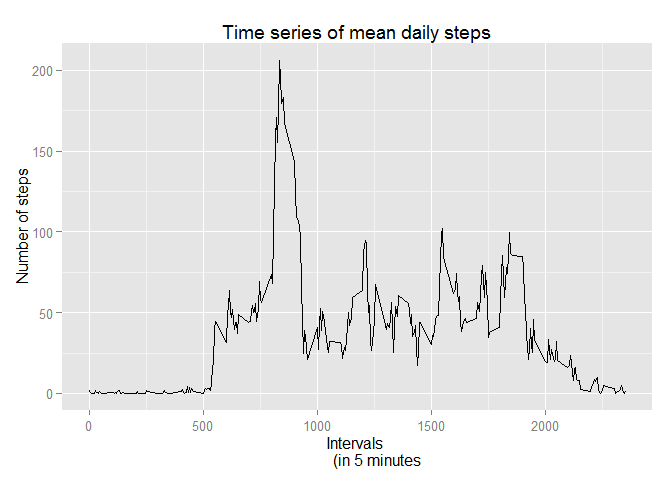
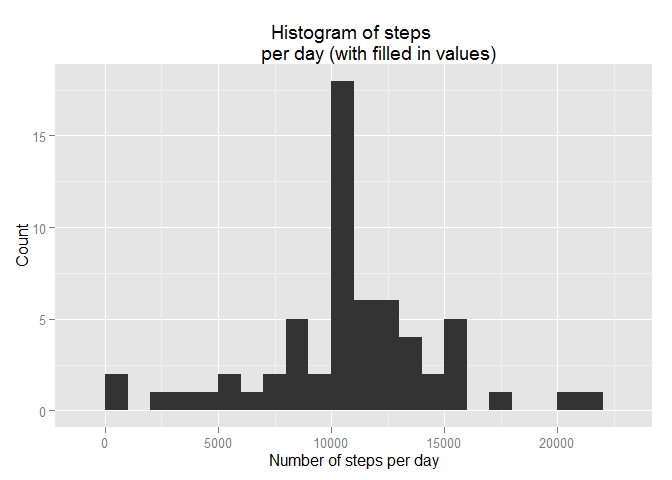
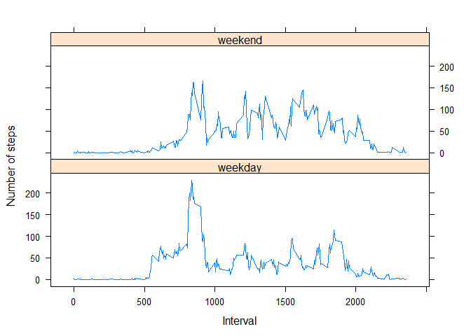

# Reproducible Research: Peer Assessment 1
Roy Yu-Wei Chen  
Jan 14th, 2015  

**Github link:** <https://github.com/Crazydiamond13/RepData_PeerAssessment1>

#Introduction
This is the peer assessment 1 R markdown document from the Coursera 
Reproducible Research course. It takes a data file called activity.csv 
(from a zip file: activity.zip) and answers the questions stated from 
the assignment instructions.

The data file includes these variables:

**steps:** Number of steps taking in a 5-minute interval (missing values 
               are coded as NA)
**date:** The date on which the measurement was taken in YYYY-MM-DD format
**interval:** Identifier for the 5-minute interval in which measurement 
               was taken

There are total of 17,568 observations (15264 after removing NAs).

For this assignment, the echo will be set to TRUE for everything,
(echo = TRUE) so that it facilitate marking by others.

First, load packages and set global options for echo.


```r
library(knitr)
```

```
## Warning: package 'knitr' was built under R version 3.1.2
```

```r
library(ggplot2)
```

```
## Warning: package 'ggplot2' was built under R version 3.1.2
```

```r
opts_chunk$set(echo = TRUE)
```

## Loading and preprocessing the data
Load, process/transform the data (if necessary) to a format 
suitable for analysis.

```r
data <- read.table(unz("activity.zip", "activity.csv"), header = TRUE, 
                  na.strings = "NA", sep = ",", 
                  colClasses = c("integer", "Date", "factor"))
head(data)
```

```
##   steps       date interval
## 1    NA 2012-10-01        0
## 2    NA 2012-10-01        5
## 3    NA 2012-10-01       10
## 4    NA 2012-10-01       15
## 5    NA 2012-10-01       20
## 6    NA 2012-10-01       25
```

## What is mean total number of steps taken per day?

###1) total number of steps taken each day:
Since the question is asked in regards to date, first calculate total number
of steps taken per day.

```r
sub.data <- na.omit(data)
total.steps <- aggregate(steps ~ date, sub.data, sum)
head(total.steps)
```

```
##         date steps
## 1 2012-10-02   126
## 2 2012-10-03 11352
## 3 2012-10-04 12116
## 4 2012-10-05 13294
## 5 2012-10-06 15420
## 6 2012-10-07 11015
```


```r
ggplot(total.steps, aes(x = steps)) + geom_histogram(binwidth = 1000) + 
          labs(title = "Histogram of steps per day", 
          x = "Number of steps per day", y = "Count")
```

 

###2) Mean and Median total steps taken per day:

```r
mean.steps <- mean(total.steps$steps)
median.steps <- median(total.steps$steps)
```
Looks like the mean total number of steps per day is:

```r
mean.steps
```

```
## [1] 10766.19
```
And median is:

```r
median.steps
```

```
## [1] 10765
```

## What is the average daily activity pattern?

###1)Time plot of 5 minute interval mean number of steps taken:

```r
mean.daily.steps <- aggregate(sub.data$steps, list(interval = 
                    as.numeric(as.character(sub.data$interval))), mean)
colnames(mean.daily.steps) <- c("interval", "daily_mean_steps")
head(mean.daily.steps)
```

```
##   interval daily_mean_steps
## 1        0        1.7169811
## 2        5        0.3396226
## 3       10        0.1320755
## 4       15        0.1509434
## 5       20        0.0754717
## 6       25        2.0943396
```

Lets plot the mean daily steps:

```r
ggplot(mean.daily.steps, aes(interval, daily_mean_steps)) + geom_line() + 
          labs(title = "Time series of mean daily steps", x = "Intervals 
          (in 5 minutes", y = "Number of steps")
```

 

###2)maximum number of steps in the data:

```r
max.steps <- mean.daily.steps[mean.daily.steps$daily_mean_steps == 
             max(mean.daily.steps$daily_mean_steps),]
```

Looks like the maximum number of steps in the data occurs at:

```r
max.steps$interval
```

```
## [1] 835
```
with a mean steps of:

```r
max.steps$daily_mean_steps
```

```
## [1] 206.1698
```

## Imputing missing values

###1)Calculate and report the total number of missing values in the 
###dataset (i.e. the total number of rows with NAs)
number of missing data is:

```r
nrow(data[is.na(data$steps),])
```

```
## [1] 2304
```

###2)Devise a strategy for filling in all of the missing values in 
###the dataset. The strategy does not need to be sophisticated. For 
###example, you could use the mean/median for that day, or the mean for 
###that 5-minute interval, etc.
I will use the mean from the 5-minute interval to fill in the NAs.

```r
impute.data <- merge(data, mean.daily.steps, by = "interval", sort = F)
head(impute.data)
```

```
##   interval steps       date daily_mean_steps
## 1        0    NA 2012-10-01         1.716981
## 2        0     0 2012-11-23         1.716981
## 3        0     0 2012-10-28         1.716981
## 4        0     0 2012-11-06         1.716981
## 5        0     0 2012-11-24         1.716981
## 6        0     0 2012-11-15         1.716981
```


```r
## merge NA values with averages rounding up for integers
impute.data$steps[is.na(impute.data$steps)] <- as.integer(
        round(impute.data$daily_mean_steps[is.na(impute.data$steps)]))
head(impute.data)
```

```
##   interval steps       date daily_mean_steps
## 1        0     2 2012-10-01         1.716981
## 2        0     0 2012-11-23         1.716981
## 3        0     0 2012-10-28         1.716981
## 4        0     0 2012-11-06         1.716981
## 5        0     0 2012-11-24         1.716981
## 6        0     0 2012-11-15         1.716981
```
impute.data looks good; now it has a 4th column with the daily mean
steps and it is slotted into the 2nd column (steps) if its value
is NA.
At this moment the impute.data is out of order compared to original.

To make sure I have captured all the NAs:

```r
sum(!complete.cases(impute.data))
```

```
## [1] 0
```
Great to see that the sum is zero (meaning no NAs unfilled).

###3)Create a new dataset that is equal to the original dataset but with the
###missing data filled in.

```r
names.to.keep <- names(data)
impute.data <- impute.data[names.to.keep]
head(impute.data)
```

```
##   steps       date interval
## 1     2 2012-10-01        0
## 2     0 2012-11-23        0
## 3     0 2012-10-28        0
## 4     0 2012-11-06        0
## 5     0 2012-11-24        0
## 6     0 2012-11-15        0
```

Now I reorder the imputed data to look like the original:

```r
new.data <- impute.data[order(impute.data$date),]
head(new.data)
```

```
##     steps       date interval
## 1       2 2012-10-01        0
## 63      0 2012-10-01        5
## 128     0 2012-10-01       10
## 205     0 2012-10-01       15
## 264     0 2012-10-01       20
## 327     2 2012-10-01       25
```

###4)Make a histogram of the total number of steps taken each day and 
###Calculate and report the mean and median total number of steps taken 
###per day. Do these values differ from the estimates from the first 
###part of the assignment? What is the impact of imputing missing data 
###on the estimates of the total daily number of steps?

```r
## (total number of (steps taken per day))
new.total.steps <- aggregate(steps ~ date, new.data, sum)

## add descriptive variable names
names(new.total.steps)[2] <- "new_steps"

## check out new data frame
head(new.total.steps, 5)
```

```
##         date new_steps
## 1 2012-10-01     10762
## 2 2012-10-02       126
## 3 2012-10-03     11352
## 4 2012-10-04     12116
## 5 2012-10-05     13294
```


```r
ggplot(new.total.steps, aes(x = new_steps)) + 
          geom_histogram(binwidth = 1000) + labs(title = "Histogram of steps 
          per day (with filled in values)", x = "Number of steps per day", 
          y = "Count")
```

 

Lets look at the new mean and median of total steps each day:

```r
new.mean.steps <- mean(new.total.steps$new_steps)
new.median.steps <- median(new.total.steps$new_steps)
```
Looks like the new mean total number of steps per day is:

```r
new.mean.steps
```

```
## [1] 10765.64
```
And the new median is:

```r
new.median.steps
```

```
## [1] 10762
```

Looks like the value differs slightly from the previous mean and median.

Mean without NA:10766.19 versus mean with filled NA: 10765.64 which is 
virtually the same.  
Median without NA: 10765 versus median with filled NA: 
10762 which is 3 steps difference.

The impact of imputing missing data on the estimate of total steps is at
most marginal... with the inclusion of filled in NA putting the median at 
a few steps higher than those without NA inclusion.

## Are there differences in activity patterns between weekdays and weekends?

###1)Create a new factor variable in the dataset with two levels - "weekday"
###and "weekend" indicating whether a given date is a weekday or weekend
###day.
Create a new column to take in the factors as weekday or weekend:

```r
days <- as.factor(weekdays(new.data$date))
levels(days)
```

```
## [1] "Friday"    "Monday"    "Saturday"  "Sunday"    "Thursday"  "Tuesday"  
## [7] "Wednesday"
```

```r
levels(days) <- list(weekday = c("Monday", "Tuesday", "Wednesday", 
                    "Thursday", "Friday"), 
                    weekend = c("Saturday", "Sunday"))
levels(days)
```

```
## [1] "weekday" "weekend"
```

```r
week.data <- cbind(new.data, days)
```
So now I have a new data with an extra column for whether the date is
weekday or weekend.

###2)Make a panel plot containing a time series plot (i.e. type = "l") 
###of the 5-minute interval (x-axis) and the average number of steps taken, 
###averaged across all weekday days or weekend days (y-axis).

```r
new.mean.daily.steps <- aggregate(week.data$steps, list(interval = 
                         as.numeric(as.character(week.data$interval)), 
                         days = week.data$days), mean)
colnames(new.mean.daily.steps)[3] <- "daily_mean_steps"
head(new.mean.daily.steps)
```

```
##   interval    days daily_mean_steps
## 1        0 weekday       2.28888889
## 2        5 weekday       0.40000000
## 3       10 weekday       0.15555556
## 4       15 weekday       0.17777778
## 5       20 weekday       0.08888889
## 6       25 weekday       1.57777778
```

Now lets plot the time series for both weekdays and weekend:

```r
library(lattice)
xyplot(new.mean.daily.steps$daily_mean_steps ~ new.mean.daily.steps$interval | 
          new.mean.daily.steps$days, layout = c(1, 2), type = "l", 
          xlab = "Interval", ylab = "Number of steps")
```

 
